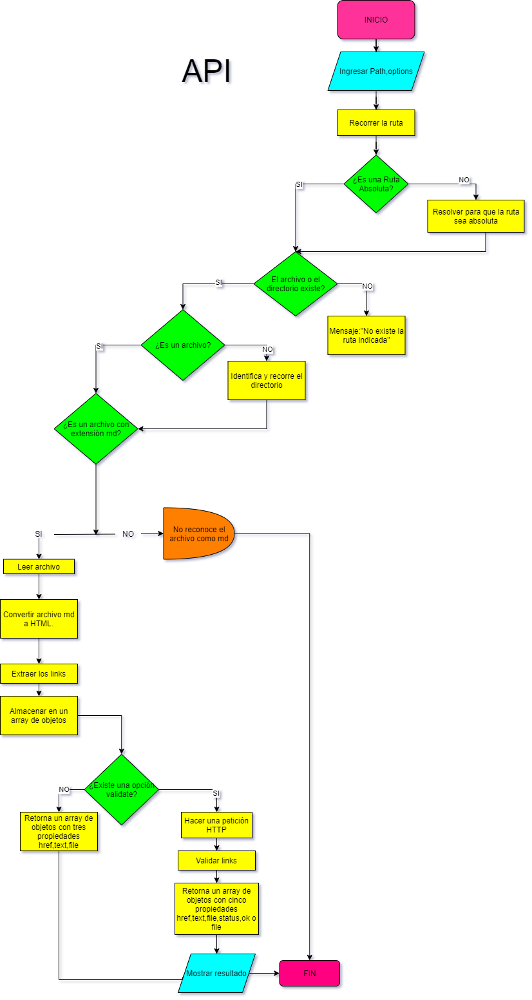
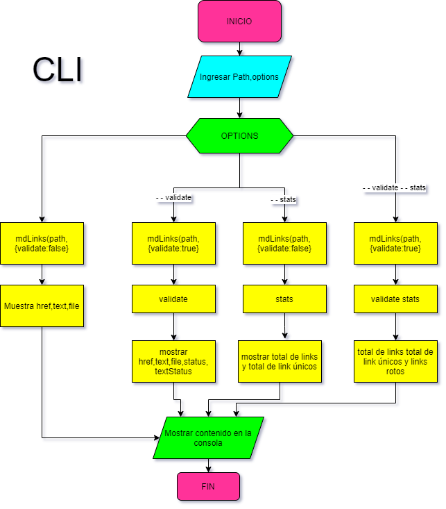

                 __  __            _       _                       P.T.G
                |  \/  | __ _ _ __| | ____| | _____      ___ __
                | |\/| |/ _` | '__| |/ / _` |/ _ \ \ /\ / / '_ \
                | |  | | (_| | |  |   < (_| | (_) \ V  V /| | | |
 🔗🔗🔗🔗🔗  |_|  |_|\__,_|_|  |_|\_\__,_|\___/ \_/\_/ |_| |_| 🔗🔗🔗🔗🔗

 La librería 'Markdown-Links'sirve para detectar los links que contiene un archivo con extensión .md, y hace cálculos estadísticos con respecto al total, unique y los links broken.
 
# 🔗Diagramas de Flujo 

# 🔗Instalación
## 🧩 Global

npm install -g git://github.com/paotovar/LIM014-mdlinks

## 🧩 Local

npm install git://github.com/paotovar/LIM014-mdlinks

# 🔗Para usarlo
## 🧩 JAVASCRIPT API

Importa como módulo  
const { mdLinks } = require('mdlinks');
Por ejemplo:

const { mdLinks } = require("mdlinks");

mdLinks("./some/example.md")
  .then(links => {
    // => [{ href, text, file }]
  })
  .catch(console.error);

mdLinks("./some/example.md", { validate: true })
  .then(links => {
    // => [{ href, text, file, status, ok }]
  })
  .catch(console.error);

mdLinks("./some/dir")
  .then(links => {
    // => [{ href, text, file }]
  })
  .catch(console.error);

## 🧩 Através de línea de comandos (CLI)
md-links <path-to-file> [options]

Instrucciones 
⚠️md-links < path-to-file >  
⚠️md-links < path-to-file > --validate  
⚠️md-links < path-to-file > --stats  
⚠️md-links < path-to-file > --stats --validate

Por ejemplo:

### 🧩 Sin options:
$ md-links ''./test/fileTest/README.md'' 

◾️HREF: https://nodejs.org/es/  
◾️TEXT: Este es el link  
◾PATH: C:/Users/pc/Desktop/TERCER PROYECTO/LIM014-mdlinks/test/fileTest/README.md   

◾️HREF: https://www.laboratoriaaaaa.la/  
◾️TEXT: Este es el link no existe  
◾PATH: C:/Users/pc/Desktop/TERCER PROYECTO/LIM014-mdlinks/test/fileTest/README.md   

◾️HREF: https://www.npmjs.com/package/123456789  
◾️TEXT: 404  
◾PATH: C:/Users/pc/Desktop/TERCER PROYECTO/LIM014-mdlinks/test/fileTest/README.md   
 

### 🧩 --validate || --v || --V
$ md-links ''./test/fileTest/README.md'' --validate  
HREF: https://nodejs.org/es/  
TEXT: Este es el link  
PATH: C:/Users/pc/Desktop/TERCER PROYECTO/LIM014-mdlinks/test/fileTest/README.md  
STATUS: 200  
STATUSTEXT: OK   

HREF: https://www.laboratoriaaaaa.la/  
TEXT: Este es el link no existe  
PATH: C:/Users/pc/Desktop/TERCER PROYECTO/LIM014-mdlinks/test/fileTest/README.md  
STATUS:  
STATUSTEXT: Este link no existe   

HREF: https://www.npmjs.com/package/123456789  
TEXT: 404  
PATH: C:/Users/pc/Desktop/TERCER PROYECTO/LIM014-mdlinks/test/fileTest/README.md  
STATUS: 404  
STATUSTEXT: Fail  

### 🧩 --stats || --s || --S

$ md-links './test/fileTest/README.md' --stats 
  ✔️  TOTAL: 3 
  ✔️  UNIQUE: 3 

### 🧩 --stats --validate || --s --v || --S --V ||--validate --stats

$ md-links ./test/fileTest/README.md --stats --validate 
  ✔️  TOTAL: 3 
  ✔️  UNIQUE: 3 
  ❌  BROKEN: 1 